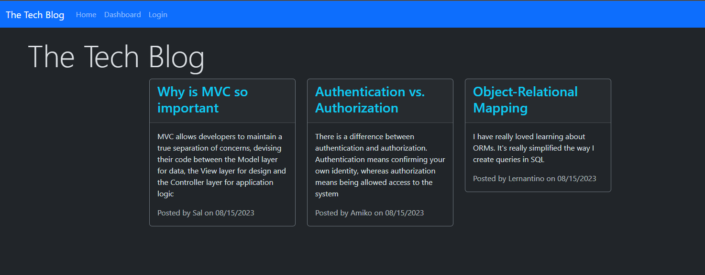

# Tech Blog

## Description

This is a tech blog created with Express and Sequelize. This blog publishes users' posts and comments. Users can also see other posts and comments. Users can create their own account and use it to login. They can add, edit and delete posts. They can also add comments to other posts. 

There were many challenges especially with the references in different models. I had a difficult time in obtaining IDs in a different model and putting it in view. I was able to get the ID referenced and have it shown in the posts and comments. This project involves all of the skills I have learned so far.

## Table of Contents 

- [Installation](#installation)
- [Usage](#usage)
- [Credits](#credits)
- [License](#license)

## Installation

N/A

## Usage

This is what the homepage looks like:

You should see a navigation bar and all of the posts in the database. When you go to a post or the dashboard without logging in, it will take you to the login page.

Once you are logged in and signed up, it will allow you to access your dashboard and the post.

Users can go on any posts and add a comment. If the logged in user is on a post they made, they can edit or delete the post.

The session cookie for the logged in user lasts for two hours. Once it expires, the session cookie is destory.

Here's a video demostration of the site:

[Tech-Blog Demo.webm](https://github.com/cmdnguyen/Tech-Blog/assets/131038401/a8e6bbca-9cd4-4482-8480-8b16361983b1)

## Credits

AskBCS

Boot Camp Tutor, Alexis Gonzalez

ChatGPT

## License

MIT License

Copyright (c) 2023 Catherine Nguyen

Permission is hereby granted, free of charge, to any person obtaining a copy of this software and associated documentation files (the "Software"), to deal in the Software without restriction, including without limitation the rights to use, copy, modify, merge, publish, distribute, sublicense, and/or sell copies of the Software, and to permit persons to whom the Software is furnished to do so, subject to the following conditions:

The above copyright notice and this permission notice shall be included in all copies or substantial portions of the Software.

THE SOFTWARE IS PROVIDED "AS IS", WITHOUT WARRANTY OF ANY KIND, EXPRESS OR IMPLIED, INCLUDING BUT NOT LIMITED TO THE WARRANTIES OF MERCHANTABILITY, FITNESS FOR A PARTICULAR PURPOSE AND NONINFRINGEMENT. IN NO EVENT SHALL THE AUTHORS OR COPYRIGHT HOLDERS BE LIABLE FOR ANY CLAIM, DAMAGES OR OTHER LIABILITY, WHETHER IN AN ACTION OF CONTRACT, TORT OR OTHERWISE, ARISING FROM, OUT OF OR IN CONNECTION WITH THE SOFTWARE OR THE USE OR OTHER DEALINGS IN THE SOFTWARE.
